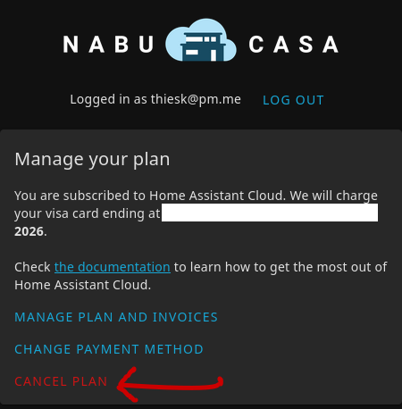

## Home Assistant Cloud

[Home Assistant Cloud](http://192.168.1.247:8123/config/cloud/account) ist ein bezahltes Feature und kann gekündigt werden.  
Unter "Konto verwalten" kann der Account bei Nabu Casa gekündigt werden. Die Logindaten sind im Passwortmanager unter "Home Assistent Cloud" gespeichert.

## Automationen

Die [Automationen](http://192.168.1.247:8123/config/automation/dashboard) können beliebig angepasst werden (wenn Zeit und Muse vorhanden) oder ganz deaktiviert werden, falls sie nicht mehr funktionieren. (Schalter auf der rechten Seite)
