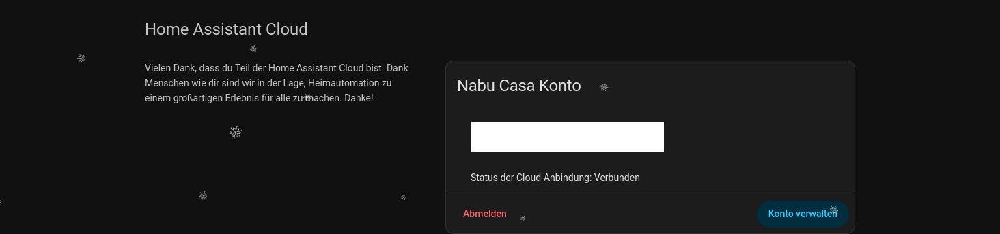
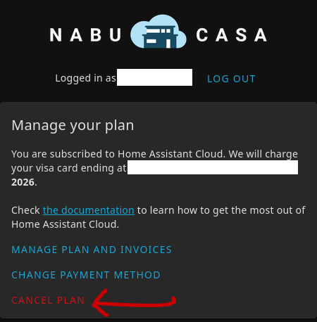

## Automationen

Die [Automationen](http://192.168.1.247:8123/config/automation/dashboard), also alle automatischen Vorgänge im Haus (z.B. Abends Licht dimmen), können hier beliebig angepasst werden.  
Falls sie nicht mehr funktionieren, können sie ganz ausgeschaltet werden (Blaue Schalter auf der rechten Seite).

## Home Assistant Cloud

[Home Assistant Cloud](http://192.168.1.247:8123/config/cloud/account) ist ein bezahltes Feature und kann gekündigt werden. Unter dem Link "[Konto verwalten](https://account.nabucasa.com/)" kann direkt gekündigt werden.  
Die Logindaten sind im Passwortmanager unter "Home Assistent Cloud" gespeichert.

Der Anbieter dieses Dienstes heißt Nabu Casa.

