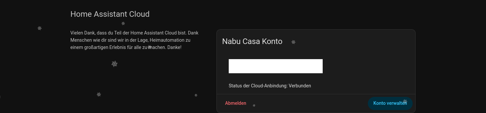
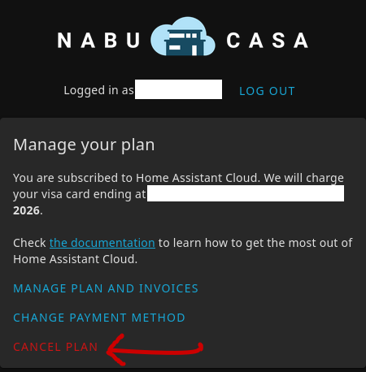

🏠 **Home Assistant** ist die Schaltzentrale für unser Smart Home. Hier siehst du alle Lichter, Heizungen, Kameras und kannst Automationen steuern.

---

## 🎯 Was du dort machen kannst

- **Lichter** ein-/ausschalten und dimmen
- **Heizung** in jedem Raum regeln
- **Kameras** ansehen
- **Automationen** verwalten (z.B. "Gute Nacht"-Modus)
- **Sensoren** ablesen (Temperatur, Luftfeuchtigkeit, Bewegung)

---

## 🔐 Zugang

- **Adresse:** http://192.168.1.247:8123
- **Benutzer:** admin
- **Passwort:** Home Assistant (auch im Passwortmanager)
- Die meisten Funktionen arbeiten **lokal** und funktionieren auch ohne Internet.

---

## 📊 Dashboard erklärt

Das Dashboard ist die Startseite von Home Assistant. Hier siehst du Karten für:
- Lichter (ein/aus, Helligkeit)
- Heizung (Soll-/Ist-Temperatur)
- Kameras (Live-Bild)
- Wetter (nur mit Internet)
- Automationen (Schalter)

Du kannst per Klick/Touch alles steuern.

---

## ⚙️ Automationen

Automationen sind automatische Abläufe, z.B.:
- "Wenn ich nach Hause komme, Licht im Flur an"
- "Um 22 Uhr alle Lichter ausschalten"

Du findest sie unter [Automationen](http://192.168.1.247:8123/config/automation/dashboard).

**Ein/Aus:** Jede Automation hat einen blauen Schalter – einfach umlegen, um sie zu aktivieren/deaktivieren.

Falls eine Automation nicht mehr funktioniert:
1. Prüfe, ob die blauen Schalter auf "ein" stehen.
2. Falls ja, aber sie läuft nicht: In den Automationen nachsehen, ob Bedingungen erfüllt sind.
3. Bei anhaltenden Problemen: Automation vorübergehend ausschalten und mich informieren.

---

## ☁️ Home Assistant Cloud (Nabu Casa)

Home Assistant Cloud ist ein bezahlter Dienst (Nabu Casa), der es ermöglicht, von unterwegs auf das Smart Home zuzugreifen (z.B. vom Handy im Garten).

- **Kosten:** ca. 6 €/Monat (jährlich)
- **Kündigung:** Unter [Konto verwalten](https://account.nabucasa.com/) möglich
- **Zugangsdaten:** Im Passwortmanager unter "Home Assistant Cloud"

Wenn du die Cloud kündigst, funktionieren alle lokalen Geräte weiter – du kannst nur nicht mehr von außen zugreifen.

---

## ❗ Home Assistant nicht erreichbar?

1. Geh zum **Server** im Netzwerkregal (das ist der Raspberry Pi/PC, auf dem HA läuft).
2. Prüfe, ob das Gerät **an ist** (Lichter/Strom).
3. Falls aus: Stecker prüfen, ggf. neu einstecken.
4. Nach 1–2 Minuten sollte Home Assistant wieder erreichbar sein.
5. Falls immer noch nicht: **Ruf mich an**.

---

## 🔄 Server/HA neu starten (für Fortgeschrittene)

Falls Home Assistant "hängt" und nicht mehr reagiert:
- Das ist selten – HA läuft sehr stabil.
- Im Zweifel den Server neu starten (Stromstecker ziehen, 5 Sekunden warten, wieder einstecken).
- Nicht oft nötig!

---

## 📱 Mobile App (falls eingerichtet)

Wenn du die Home Assistant App auf dem Handy hast:
- Die App funktioniert mit oder ohne Cloud (lokaler Zugriff).
- Falls die App nicht verbindet: Prüfe, ob du im WLAN "Home" bist.
- Die App nutzt den gleichen Login wie die Webseite.

---

**Bei Fragen zu Automationen oder Einstellungen einfach melden!**
