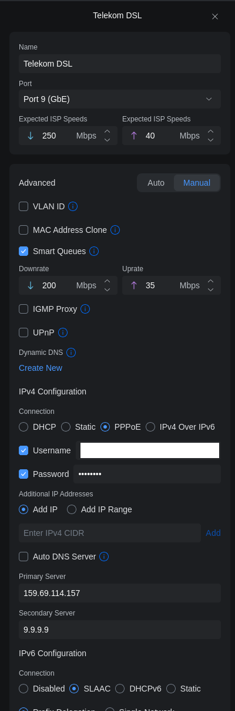
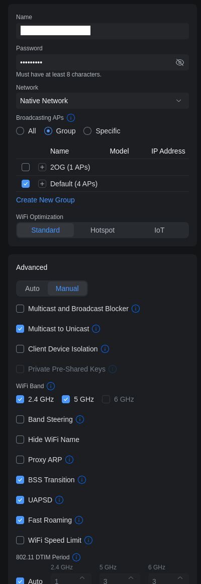

📡 **Der Router (Unifi Dream Machine Pro)** steht im Serverregal – es ist das zweite graue Gerät von oben, mit dem kleinen Bildschirm.

---

## 🌐 Was macht der Router?

Der Router verteilt das Internet an alle Geräte (WLAN & LAN) und verwaltet das WLAN-Netzwerk.  
Unser Modem arbeitet im **Bridge-Modus**, d.h. es bringt nur das Internet ins Haus; der Router übernimmt den Rest.

---

## 🔧 Einstellungen anpassen

### Internet-Zugang (Telekom)
Die Internet-Einstellungen findest du hier:  
[https://192.168.1.1/network/default/settings/internet](https://192.168.1.1/network/default/settings/internet)

Dort auf **"Telekom DSL"** klicken, um die PPPoE-Zugangsdaten einzutragen.  
Benutzername und Passwort findest du im Passwortmanager unter **"Telekom PPPoE"**.

> ⚠️ Die Oberfläche kann durch Updates leicht anders aussehen, aber die Optionen heißen in etwa gleich.

---

### WLAN-Netzwerk (Name und Passwort)
Unter den [WiFi Einstellungen](https://192.168.1.1/network/default/settings/wifi) kannst du den WLAN-Namen (SSID) und das Passwort ändern.

Die aktuellen Zugangsdaten stehen im Passwortmanager unter **"WLAN"**.

Wenn das WLAN nicht mehr funktioniert:
1. Prüfe, ob der Router grünes Licht hat.
2. Falls ja, aber WLAN immer noch nicht sichtbar: Router neu starten (Stecker ziehen, 10 Sekunden warten, wieder einstecken).
3. Nach ca. 2 Minuten sollte das WLAN wieder erscheinen.

> Du kannst die WLAN-Einstellungen auch auf **"Auto"** zurücksetzen, falls etwas schiefgelaufen ist.

---

## 🔍 Status-Check: Router-LEDs

| LED | Farbe | Bedeutung |
|-----|-------|-----------|
| Haupt-LED | 🟢 Grün | Alles in Ordnung, Router online |
| Haupt-LED | 🟡 Gelb/Orange | Startvorgang oder eingeschränkte Funktion |
| Haupt-LED | 🔴 Rot | Fehler – Modem/Internet prüfen |
| WLAN-LED | 🟢 Grün/Blinkend | WLAN aktiv |
| WLAN-LED | Aus | WLAN deaktiviert |

Falls die Haupt-LED nicht grün ist, siehe: **[Was tun, wenn das Internet nicht geht?](/)**

---

## ❗ Was bringt ein Router-Neustart?

In den seltensten Fällen nötig – weil das Modem im Bridge-Modus läuft, muss der Router meist nur warten, bis das Modem wieder online ist.  
Ein Neustart kann helfen, wenn die WLAN-Einstellungen korrupt sind oder der Router sich aufgehängt hat.

---

## 🚫 Was man besser nicht macht

- **Router auf Werkseinstellungen zurücksetzen** – das löscht alle Konfigurationen und macht viel Arbeit.  
  Nur im absoluten Notfall (z.B. Router gekauft gebraucht) und mit meiner Hilfe.

---

**Bei Fragen zu den Einstellungen einfach melden!**
